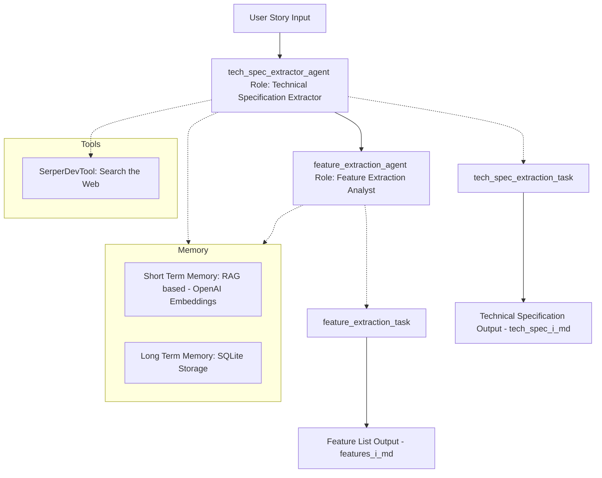

## CrewAI Feature Planning

This project implements a multi-agent workflow using CrewAI, where agents collaborate to process user stories, extract technical specifications, and break them down into implementation-ready engineering features.

## Technologies Used

CrewAI: For orchestrating agents and managing sequential task execution

OpenAI GPT-4o-mini: Language model used for task reasoning and structured output generation

SerperDevTool: Enables one of the agents to search the internet for up-to-date best practices and emerging technologies, ensuring technical outputs remain current and industry-aligned

Short-Term Memory (RAG): Allows agents to reference recent context and outputs within a session

Long-Term Memory (SQLite): Maintains historical knowledge and prior decisions across user stories to enforce consistency and avoid duplication



## Installation

Ensure you have Python >=3.10 <3.14 installed on your system. This project uses [UV](https://docs.astral.sh/uv/) for dependency management and package handling, offering a seamless setup and execution experience.

First, if you haven't already, install uv:

```bash
curl -LsSf https://astral.sh/uv/install.sh | sh
```

Run the following command from the root of your project to install crewai CLI:

```bash
uv tool install crewai
```

## Environment Setup
Before running the project, make sure to configure your API keys:

Create a .env file in the root directory of the project (if it doesn't exist).

Add the following entries to the .env file:

```
SERPER_API_KEY=your_serper_api_key_here
OPENAI_API_KEY=your_openai_api_key_here
```

Replace the placeholder values with your actual API keys.

These keys are required for:

SERPER_API_KEY: Enables internet search functionality via Serper.dev (used by SerperDevTool).

OPENAI_API_KEY: Enables language model capabilities (used for all LLM tasks).

## Running the Project

To kickstart your crew of AI agents and begin task execution, run this from the root folder of your project:

```bash
$ crewai run
```

By default, this will execute the workflow for each user story defined in main.py and generate corresponding tech_spec.md and features.md files in the output folder.
